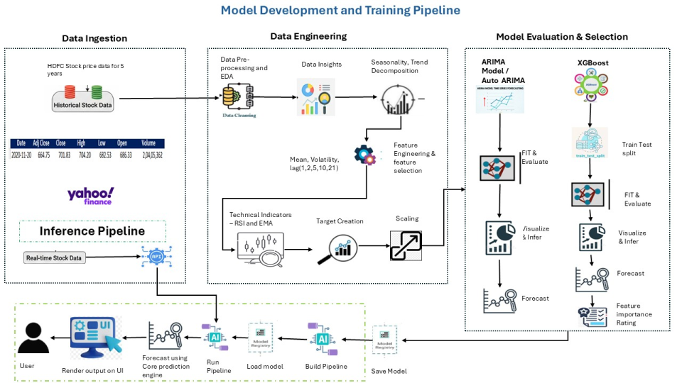
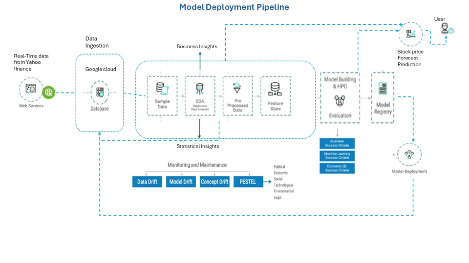

# Stock Forecasting – End-to-End ML Deployment

>An end-to-end machine learning system that converts historical stock data into **deployable, decision-support forecasts** for retail investors.

This repository implements an **end-to-end stock price forecasting system** for Indian equities, focusing on **practical deployment and decision support** rather than theoretical prediction accuracy.

The project forecasts **HDFC Bank stock prices** across short-term and medium-term horizons using time-series and machine learning models, and exposes predictions through a **Streamlit application**.

---

## Problem Context

Retail investors are often exposed to:
- High market volatility
- Manipulated price movements
- Emotion-driven trading decisions

This project demonstrates how **data-driven forecasting pipelines** can support more informed, disciplined investment decisions.

---

## Forecasting Scope

- **Asset**: HDFC Bank  
- **Data Source**: Yahoo Finance (5 years of daily data)
- **Forecast Horizons**:
  - T+1 (next trading day)
  - 30-day forward forecast

---

## Modeling Approach

Models implemented and evaluated:

- **ARIMA** – trend & seasonality modeling  
- **Auto-ARIMA** – automated order selection  
- **XGBoost** – non-linear pattern learning  

### Evaluation Metrics
- RMSE  
- MAPE  
- Directional Accuracy (Up / Down movement)

Directional accuracy is prioritized to better reflect real trading decisions.

---

## Feature Engineering

- Lag features (T-1, T-5)
- Technical indicators:
  - SMA (10, 20, 50)
  - RSI
  - MACD
  - Daily returns
- Chronological train-test split (90/10) to prevent leakage

---

## Deployment

- **Streamlit-based local application**
- Interactive visualization of forecasts
- Model artifacts saved using `joblib`

> Drift monitoring logic exists as an extension but is not the primary focus of this repository.

---

## System Architecture

## System Deployment Pipeline

## Tech Stack

- Python
- Pandas, NumPy
- scikit-learn
- XGBoost
- Statsmodels
- Streamlit
- yFinance

---

## Disclaimer

This project is intended for **technical demonstration and portfolio purposes** and does not constitute financial or investment advice.
